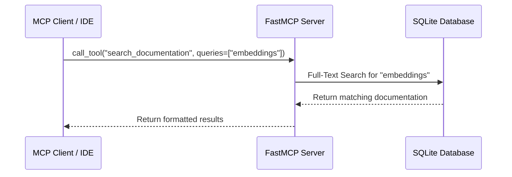

# Gemini Docs MCP Server

An MCP server that provides tools to search and retrieve Google Gemini documentation.



## Features

-   **Search Documentation**: Full-text search across all Gemini documentation pages.
-   **Get Capabilities**: List available documentation pages or retrieve content for a specific page.
-   **Get Current Model**: Quickly access documentation for current Gemini models.
-   **Automatic Updates**: Scrapes and updates documentation on server startup.

## Installation

1.  Clone the repository:
    ```bash
    git clone https://github.com/yourusername/gemini-docs-mcp.git
    cd gemini-docs-mcp
    ```

2.  Create and activate a virtual environment (recommended):
    ```bash
    python -m venv .venv
    source .venv/bin/activate  # On Windows use `.venv\Scripts\activate`
    ```

3.  Install the package:
    ```bash
    pip install .
    ```

## Usage

Run the server using the installed command:

```bash
gemini-docs-mcp
```

This will start the MCP server over stdio. It will immediately begin ingesting documentation, which might take a few moments on the first run.

### Running with `uvx`

You can also run the server directly without explicit installation using `uvx`:

```bash
uvx --from git+https://github.com/yourusername/gemini-docs-mcp gemini-docs-mcp
```

### Configuration

The database is stored at `~/.mcp/gemini-api-docs/database.db` by default. You can override this by setting the `GEMINI_DOCS_DB_PATH` environment variable.

### Using with an MCP Client

Configure your MCP client to run the `gemini-docs-mcp` command.

```json
{
  "mcpServers": {
    "gemini-docs": {
      "command": "uvx",
      "args": ["--from", "git+https://github.com/philschmid/gemini-docs-mcp", "gemini-docs-mcp"]
    }
  }
}
```

## Tools

-   `search_documentation(queries: list[str])`: Performs a full-text search on Gemini documentation for the given list of queries (max 3).
-   `get_capability_page(capability: str = None)`: Get a list of capabilities or content for a specific one.
-   `get_current_model()`: Get documentation for current Gemini models.

## License

MIT
