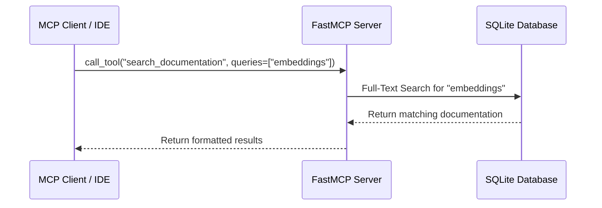

# Gemini Docs MCP Server

A remote HTTP MCP server that provides tools to search and retrieve Google Gemini API documentation. The server exposes the MCP protocol at the `/mcp` endpoint and can be deployed to Cloud Run or other containerized platforms. It also supports local stdio mode for development.

<a href="https://glama.ai/mcp/servers/@philschmid/gemini-api-docs-mcp">
  
</a>

-   **Search Documentation**: Full-text search across all Gemini documentation pages.
-   **Get Capabilities**: List available documentation pages or retrieve content for a specific page.
-   **Get Current Model**: Quickly access documentation for current Gemini models.
-   **Automatic Updates**: Scrapes and updates documentation on server startup.


## How it Works

1.  **Ingestion**: On startup, the server fetches `https://ai.google.dev/gemini-api/docs/llms.txt` to get a list of all available documentation pages.
2.  **Processing**: It then concurrently fetches and processes each page, extracting the text content.
3.  **Indexing**: The processed content is stored in a local SQLite database with a Full-Text Search (FTS5) index for efficient querying.
4.  **Searching**: When you use the `search_documentation` tool, the server queries this SQLite database to find the most relevant documentation pages.

## Installation

### Option 1: Use `uvx` (Recommended)

You can use `uvx` to run the server directly without explicit installation. This is the easiest way to get started.

```bash
uvx --from git+https://github.com/philschmid/gemini-api-docs-mcp gemini-docs-mcp
```

### Option 2: Install directly from GitHub

You can install the package directly from GitHub using `pip`:

```bash
pip install git+https://github.com/philschmid/gemini-api-docs-mcp.git
```

### Option 3: Manual Installation (for development)

```bash
git clone https://github.com/philschmid/gemini-api-docs-mcp.git
cd gemini-api-docs-mcp
pip install -e .
cd ..
rm -rf gemini-api-docs-mcp
```

## Usage

### Running as a Remote HTTP Server

The server runs as an HTTP server and exposes the MCP protocol at the `/mcp` endpoint. It respects the `PORT` environment variable (defaults to 8080).

```bash
# Set port (optional, defaults to 8080)
export PORT=8080

# Run the server
gemini-docs-mcp
```

The server will be accessible at `http://localhost:8080/mcp` (or your configured port).

### Docker Deployment

Build and run the Docker container:

```bash
# Build the image
docker build -t gemini-docs-mcp .

# Run the container
docker run -p 8080:8080 gemini-docs-mcp
```

### Cloud Run Deployment

Deploy to Google Cloud Run:

```bash
# Build and deploy
gcloud run deploy gemini-docs-mcp \
  --source . \
  --platform managed \
  --region us-central1 \
  --allow-unauthenticated
```

The server will be accessible at `https://<your-service-url>/mcp`.

### Running in Stdio Mode (Local)

If you don't set the `PORT` environment variable, the server runs in stdio mode for local MCP clients:

```bash
# Don't set PORT - runs in stdio mode
gemini-docs-mcp
```

### Configuration

The database is stored at:
- `/tmp/gemini-api-docs/database.db` in containerized environments
- `~/.mcp/gemini-api-docs/database.db` in local environments

You can override this by setting the `GEMINI_DOCS_DB_PATH` environment variable.

### Using with an MCP Client

For remote HTTP servers, configure your MCP client to connect via HTTP:

```json
{
  "mcpServers": {
    "gemini-docs": {
      "url": "https://<your-service-url>/mcp"
    }
  }
}
```

For local development with stdio (if supported by your client):

```json
{
  "mcpServers": {
    "gemini-docs": {
      "command": "gemini-docs-mcp"
    }
  }
}
```

## Tools

-   `search_documentation(queries: list[str])`: Performs a full-text search on Gemini documentation for the given list of queries (max 3).
-   `get_capability_page(capability: str = None)`: Get a list of capabilities or content for a specific one.
-   `get_current_model()`: Get documentation for current Gemini models.

## Manual Refresh Endpoint

When running as an HTTP server, you can manually trigger documentation ingestion using the `/refresh` endpoint. This is useful for updating documentation without redeploying the server.

### Endpoints

- **`POST /refresh`** or **`GET /refresh`**: Triggers documentation ingestion in the background. Returns immediately with a 202 status.
- **`GET /refresh/status`**: Returns the current ingestion status (`idle`, `running`, `completed`, or `failed`) and the last run timestamp.
- **`GET /health`**: Health check endpoint for Cloud Run and monitoring.

### Usage

```bash
# Trigger a refresh (POST or GET)
curl -X POST https://<your-service-url>/refresh

# Check refresh status
curl https://<your-service-url>/refresh/status

# Health check
curl https://<your-service-url>/health
```

### Response Examples

**Refresh triggered:**
```json
{
    "status": "started",
    "message": "Documentation ingestion started in background"
}
```

**Status while running:**
```json
{
    "status": "running",
    "last_run": null,
    "error": null
}
```

**Status when completed:**
```json
{
    "status": "completed",
    "last_run": "2025-11-24T21:59:20.165232+00:00",
    "error": null
}
```

### Notes

- The refresh runs asynchronously and doesn't block the server. MCP tools continue to work while ingestion is running.
- Ingestion typically takes 1-3 minutes depending on the number of documentation pages.
- The database is updated incrementally (only changed pages are updated).
- If a refresh is already running, calling `/refresh` again returns a 202 with "in_progress" status.

## License

MIT

## Test Results

We run a comprehensive evaluation harness to ensure the MCP server provides accurate and up-to-date code examples. The tests cover both Python and TypeScript SDKs.

| Metric | Value |
| :--- | :--- |
| Total Tests | 117 |
| Passed | 114 |
| Failed | 3 |

*Last updated: 2025-11-03 13:29:01*

You can find the detailed test results in `tests/result.json`.