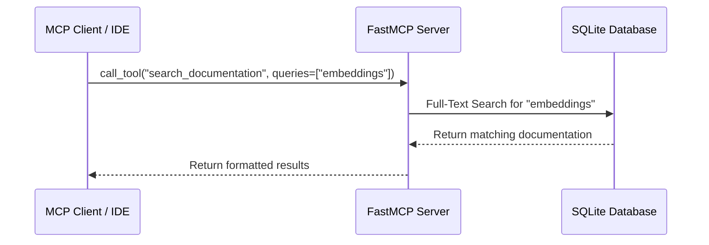

# Gemini Docs MCP Server

An local STDIO MCP server that provides tools to search and retrieve Google Gemini API documentation.

-   **Search Documentation**: Full-text search across all Gemini documentation pages.
-   **Get Capabilities**: List available documentation pages or retrieve content for a specific page.
-   **Get Current Model**: Quickly access documentation for current Gemini models.
-   **Automatic Updates**: Scrapes and updates documentation on server startup.



## Installation

### Option 1: Use `uvx` (Recommended)

You can use `uvx` to run the server directly without explicit installation. This is the easiest way to get started.

```bash
uvx --from git+https://github.com/philschmid/gemini-api-docs-mcp gemini-docs-mcp
```

### Option 2: Install directly from GitHub

You can install the package directly from GitHub using `pip`:

```bash
pip install git+https://github.com/philschmid/gemini-api-docs-mcp.git
```

### Option 3: Manual Installation (for development)

```bash
git clone https://github.com/philschmid/gemini-api-docs-mcp.git
cd gemini-api-docs-mcp
pip install -e .
cd ..
rm -rf gemini-api-docs-mcp
```

## Usage

If you installed via `pip` (Option 2 or 3), run the server using:

```bash
gemini-docs-mcp
```

This will start the MCP server over stdio. It will immediately begin ingesting documentation, which might take a few moments on the first run.

### Configuration

The database is stored at `~/.mcp/gemini-api-docs/database.db` by default. You can override this by setting the `GEMINI_DOCS_DB_PATH` environment variable.

### Using with an MCP Client

Configure your MCP client to run the `gemini-docs-mcp` command.

```json
{
  "mcpServers": {
    "gemini-docs": {
      "command": "uvx",
      "args": ["--from", "git+https://github.com/philschmid/gemini-api-docs-mcp", "gemini-docs-mcp"]
    }
  }
}
```


```json
{
  "mcpServers": {
    "gemini-docs": {
      "command": "gemini-docs-mcp",
    }
  }
}
```

## Tools

-   `search_documentation(queries: list[str])`: Performs a full-text search on Gemini documentation for the given list of queries (max 3).
-   `get_capability_page(capability: str = None)`: Get a list of capabilities or content for a specific one.
-   `get_current_model()`: Get documentation for current Gemini models.

## License

MIT
